 

>I wanna love you but I better not touch (don't touch) |
>I wanna hold you, but my senses tell me to stop |
>I wanna kiss you but I want it too much (too much) |
>I wanna taste you but your lips are venomous poison |
>You're poison, running through my veins |
>You're poison |
I don't want to break these chains

(<a href="https://www.youtube.com/watch?v=Qq4j1LtCdww">Poison</a>, 1989 song released on the album *Trash*, by Alice Cooper)

# Brief description

# Citation

At this moment, you can reference Poisoned texts this way:

Cabedo, A. (2022). Poisoned texts. v.1.0 (beta). Available at https://github.com/acabedo/poisonedtexts

# Special mention and acknowledgments

Part of speech tagging is a mandatory input for Poisoned texts. That input won't be possible without the aid of UdPipe R Package (Wijffels 2022), available at https://github.com/bnosac/udpipe. In addition, the benefit of using Udpipe is that Poisoned texts can cover a bunch of different languages. By now, the selecting options are Spanish, Catalan, English, Italian, German, French, Portuguese and Chinese (this last one only in an experimental state); another languages can also be integrated with a very little modification of the app.

# Video tutorial

Some of the features of this script are shown in this short video:

https://youtu.be/rPq5sKLoDb8

# Online demo

An online version of Poisoned texts is available at https://adrin-cabedo.shinyapps.io/poisonedtexts/

# Sample reports generated

You can take a look to the report files generated by Poisonedtexts. These files include three different formats: PDF, Docx and html. You can check these reports at these link <https://github.com/acabedo/poisonedtexts/tree/main/samples/reports>

The sample TXT inputs are also available at [<https://github.com/acabedo/poisonedtexts/tree/main/samples/txts>](https://github.com/acabedo/poisonedtexts/tree/main/samples/test_txts_wikipedia). All these files have been taken literally from their online resources, i.e. Wikipedia, and they are only brief excerpts from the full entries.

# Requirements 

## R versions

Required: R version 3.6.0 or later

Required: A modern browser (e.g., Chrome or Safari). Internet Explorer
(version 11 or higher) should work as well

Required: Rstudio 1.4.1717 or later

## R packages required

[[1]]
Wijffels J (2022). _udpipe: Tokenization, Parts of
Speech Tagging, Lemmatization and Dependency
Parsing with the 'UDPipe' 'NLP' Toolkit_. R package
version 0.8.9,
<https://CRAN.R-project.org/package=udpipe>.

[[2]]
Chang W, Cheng J, Allaire J, Sievert C, Schloerke
B, Xie Y, Allen J, McPherson J, Dipert A, Borges B
(2021). _shiny: Web Application Framework for R_. R
package version 1.7.1,
<https://CRAN.R-project.org/package=shiny>.

[[3]]
Xie Y, Cheng J, Tan X (2022). _DT: A Wrapper of the
JavaScript Library 'DataTables'_. R package version
0.23, <https://CRAN.R-project.org/package=DT>.

[[4]]
Wickham H, Averick M, Bryan J, Chang W, McGowan LD,
François R, Grolemund G, Hayes A, Henry L, Hester
J, Kuhn M, Pedersen TL, Miller E, Bache SM, Müller
K, Ooms J, Robinson D, Seidel DP, Spinu V,
Takahashi K, Vaughan D, Wilke C, Woo K, Yutani H
(2019). “Welcome to the tidyverse.” _Journal of
Open Source Software_, *4*(43), 1686.
doi:10.21105/joss.01686
<https://doi.org/10.21105/joss.01686>.

[[5]]
Schmidt D, Heckendorf C (2022). “ngram: Fast n-Gram
Tokenization.” R package version 3.2.1,
<https://cran.r-project.org/package=ngram>.

Schmidt D, Heckendorf C (2022). _Guide to the ngram
Package: Fast n-gram Tokenization_. R Vignette,
<https://cran.r-project.org/package=ngram>.

[[6]]
Silge J, Robinson D (2016). “tidytext: Text Mining
and Analysis Using Tidy Data Principles in R.”
_JOSS_, *1*(3). doi:10.21105/joss.00037
<https://doi.org/10.21105/joss.00037>,
<http://dx.doi.org/10.21105/joss.00037>.

[[7]]
Rinker TW (2021). _textreadr: Read Text Documents
into R_. version 1.2.0,
<https://github.com/trinker/textreadr>.

[[8]]
Gagolewski M (2021). “stringi: Fast and portable
character string processing in R.” _Journal of
Statistical Software_. to appear.

Gagolewski M (2021). _stringi: Fast and portable
character string processing in R_. R package
version 1.7.6, <https://stringi.gagolewski.com/>.

[[9]]
Wickham H (2007). “Reshaping Data with the reshape
Package.” _Journal of Statistical Software_,
*21*(12), 1-20.
<http://www.jstatsoft.org/v21/i12/>.

[[10]]
Sali A, Attali D (2020). _shinycssloaders: Add
Loading Animations to a 'shiny' Output While It's
Recalculating_. R package version 1.0.0,
<https://CRAN.R-project.org/package=shinycssloaders>.

[[11]]
Sievert C (2020). _Interactive Web-Based Data
Visualization with R, plotly, and shiny_. Chapman
and Hall/CRC. ISBN 9781138331457,
<https://plotly-r.com>.

# Screenshots

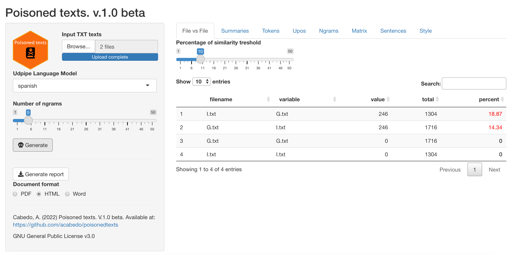 
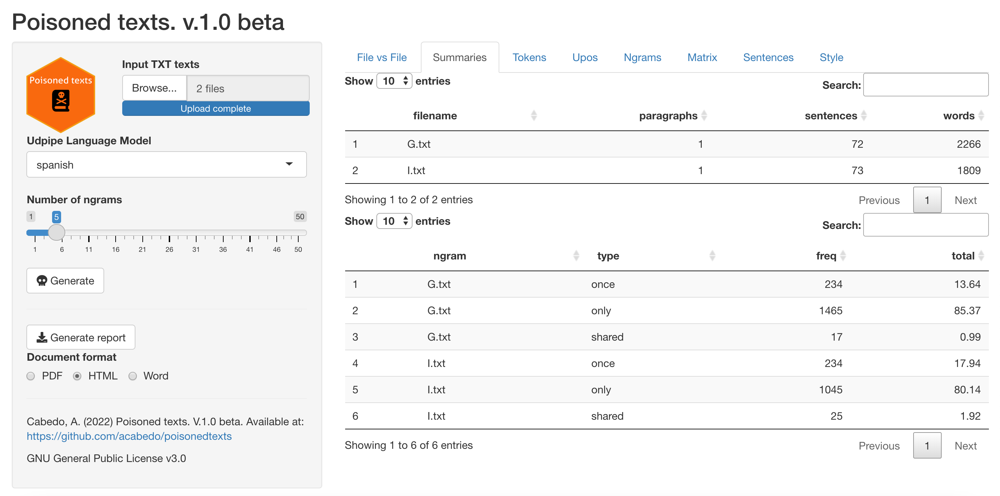 
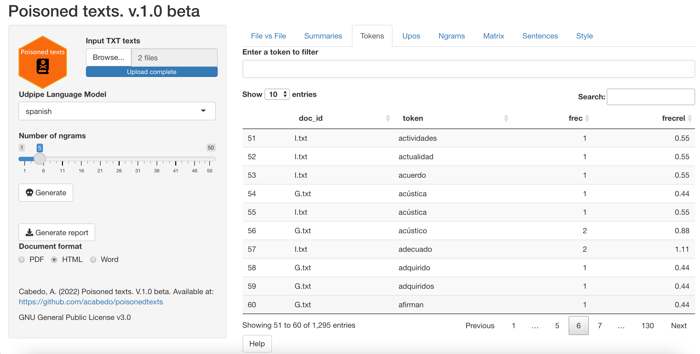 
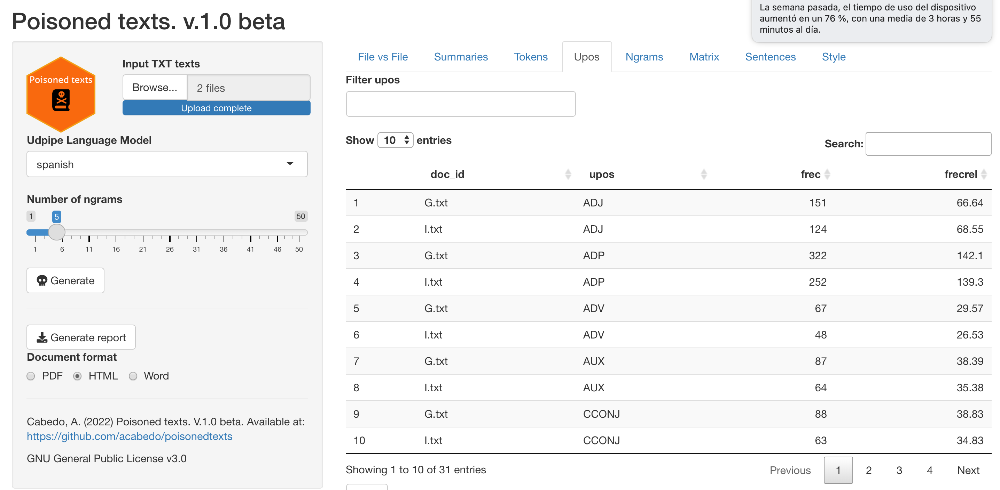 
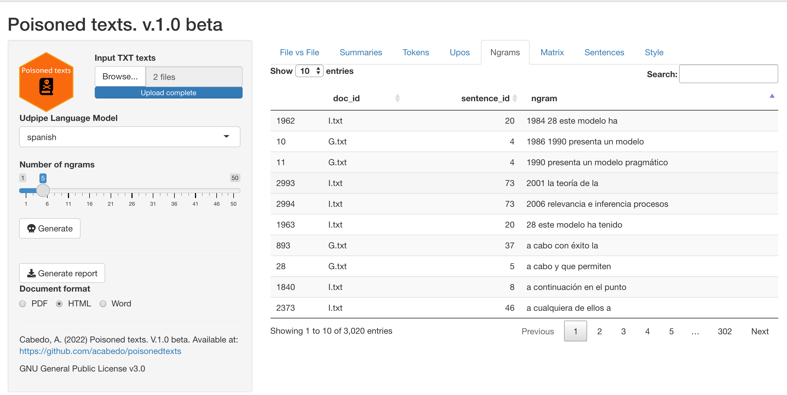
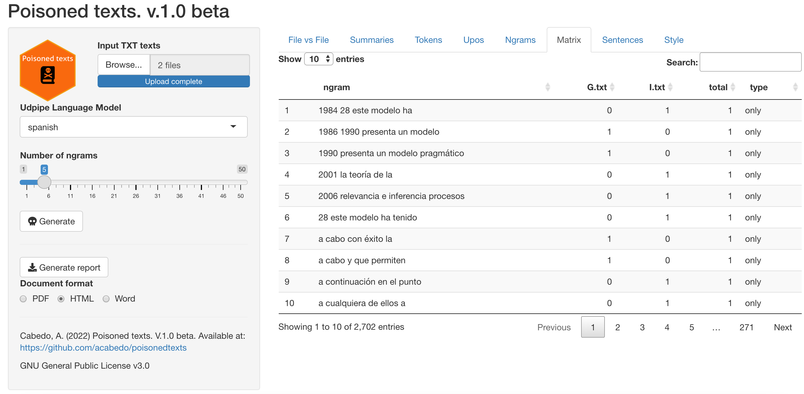
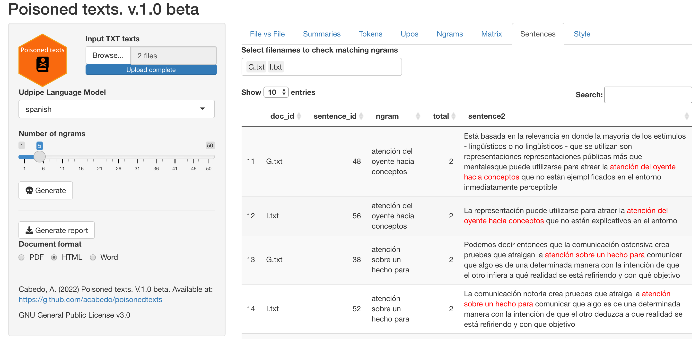 
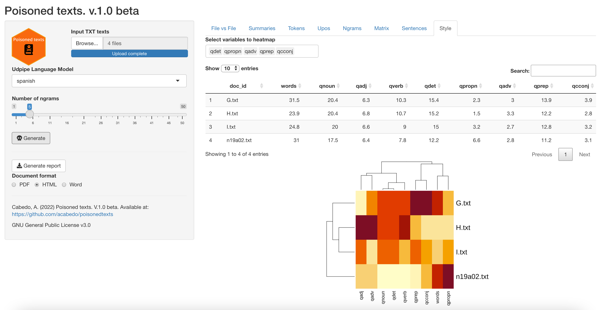 
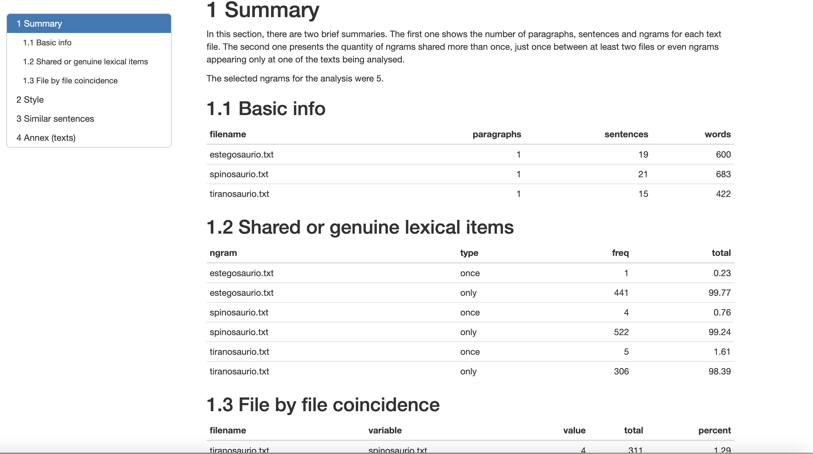 
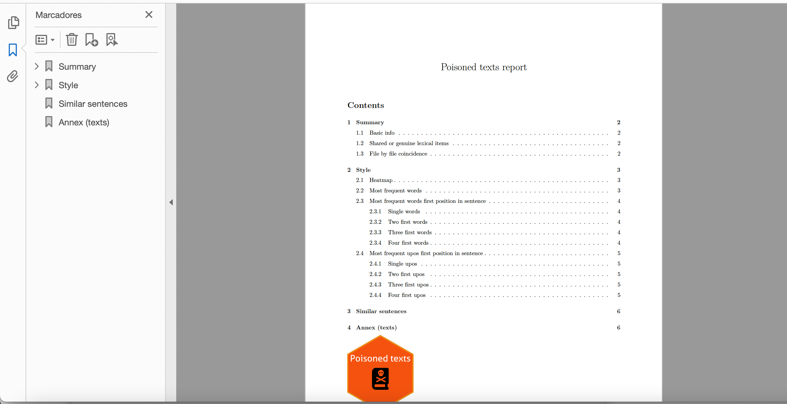 
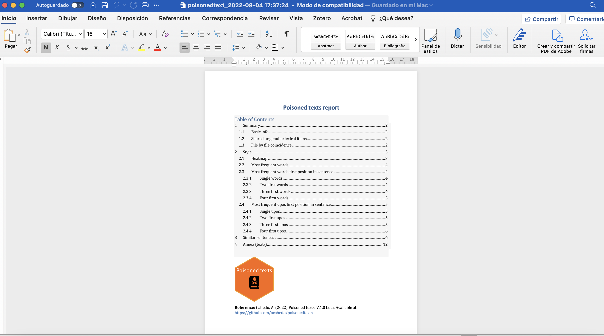 

# Inspirational work

Poisoned texts, as a very basic verbatim plagiarism detection tool, follows some of the rules developed by David Wools in Copycatch, version from 2003. Furthermore, the kind of ngrams treatment developed by Laurence Anthony in Antconc was considered a good trick to find verbatim coincidence and similarity among texts. Finally, the heatmap has been previously introduced and tested in other exploratory tools, like Oralstats [https://github.com/acabedo/oralstats] 

# Caution

All errors and omissions (bad statistical operations [means, medians...], bad visualizations, etc.) remain the author's sole responsibility.

# License

GNU General Public License v3.0 Permissions of this strong copyleft license are conditioned on making available complete source code of licensed works and modifications, which include larger works using a licensed work, under the same license. Copyright and license notices must be preserved. Contributors provide an express grant of patent rights.
